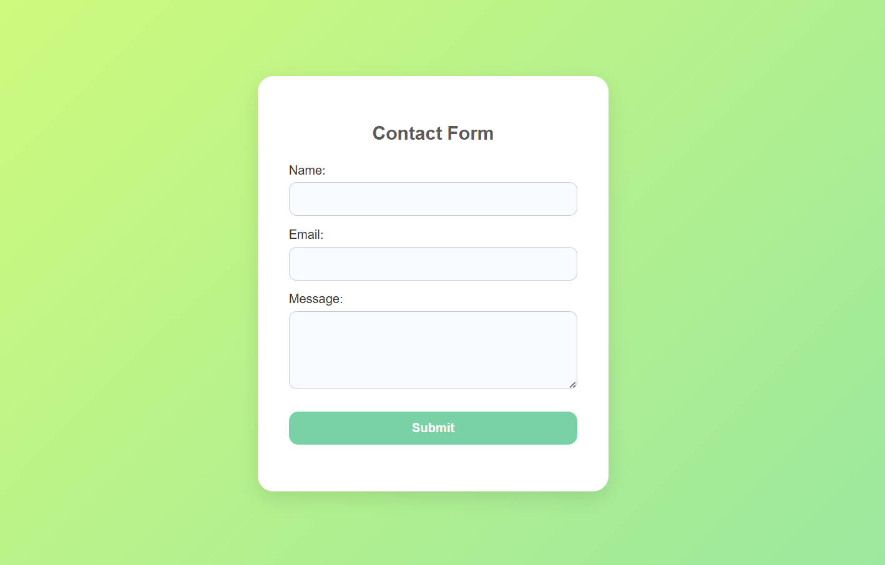

# task-6

Create a Contact Form and Validate Inputs Using JavaScript

## Description:

I built a fully functional contact form using HTML, CSS, and JavaScript. The form includes client-side validation for **name**, **email**, and **message** inputs.

## Features added

- Stylish, mobile-friendly UI with pastel gradient background.
- Validates fields for:
  - Non-empty Name
  - Valid Email Format (Regex)
  - Non-empty Message
- Shows clear error messages below each input.
- Shows a success message on valid form submission (no actual email sending).
- Smooth transitions and hover effects for better UX.

## Tools Used

- Visual Studio Code
- HTML5 & CSS3
- JavaScript (Vanilla)
- Chrome Browser (for testing)

## Files Included

- `index.html`: Main HTML file with contact form structure
- `styles.css`: Fun & creative styling using pastel colors
- `script.js`: JavaScript validation logic
- `README.md`: Project description

## Screenshot

